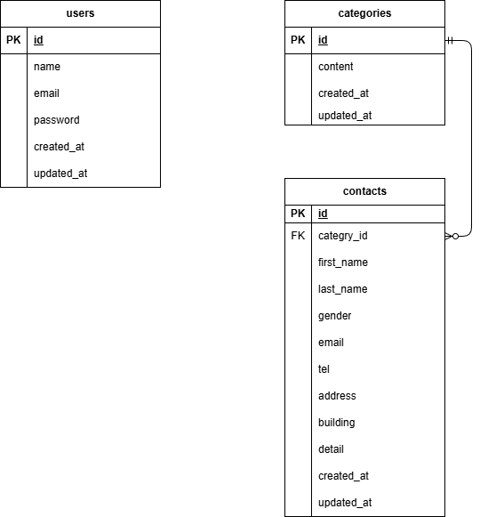

## アプリケーション名

FashionablyLate

## 環境構築

1⃣　Dockerビルド

① アプリケーションを作成するために、開発環境を GitHub からクローンします。

```
コマンドライン上

git clone git@github.com:HIDE52/hide-kadai1.git
mv hide-kadai1 FashionablyLate
```

② 開発環境を構築します。

```
コマンドライン上

cd FashionablyLate
docker-compose up -d --build
code .
```

③「Docker Desktop 」の確認を行い、FashionablyLateコンテナが作成されているか確認を行います。

2⃣　Laravelの初期設定

① Dockerコンテナ内に移動します。

```
コマンドライン上

docker-compose exec php bash
```

② 必要なパッケージをインストールします。

```
PHPコンテナ上

composer install
```

③ 設定ファイル（.env）を作成し、データベースの接続先を書き換えます。

```
PHPコンテナ上

cp .env.example .env
```

.env ファイルを開き、以下の項目をdocker-compose.yml の設定に合わせて 書き換えて保存してください

``
envファイル

DB_CONNECTION=mysql
DB_HOST=mysql
DB_PORT=3306
DB_DATABASE=laravel_db
DB_USERNAME=laravel_user
DB_PASSWORD=laravel_pass

```

④ セキュリティに必要な「鍵」を作ります。
```

PHPコンテナ上

php artisan key:generate

```

3⃣ データベースの構築

⑥ データベースにテーブルを作成します。

```

PHPコンテナ上

php artisan migrate

```

⑦ 初期データ（テストデータ）を登録します。

```

PHPコンテナ上

php artisan db:seed

```


## 使用技術(実行環境)

- PHP 8.1.34
- Laravel 8.83.8
- MySQL 8.0.26
- Nginx 1.21.1

## URL

お問い合わせ画面：http://localhost/
ユーザー登録：http://localhost/register
ログイン：http://localhost/login
phpMyAdmin (DB確認ツール)：http://localhost:8080/

## ER図


```
